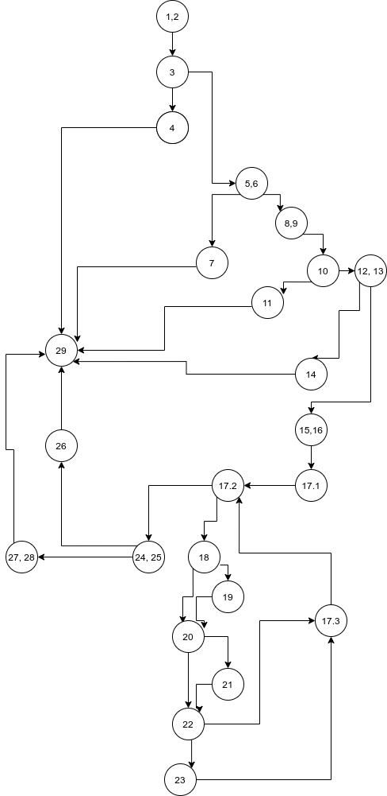

##Документација за lab2 151179 Group 3

”12345678”
###Cyclomatic Complexity
nodes: 24, edges 32, cyclomatic complexity E-N+2 = 32-24+2 = 10

number of regions:  10

P+1 = 9+1 = 10

Има 6 можни случаеви 
- Да заврши со првиот Runtime Exception
- Да заврши со вториот Runtime Exception
- Да заврши со првиот false
- Да заврши со вториот false
- Да заврши со третиот false
- Да заврши со true

##Табела1

|Every Statement |	user = null, allUsers = any |user.username = null, user.password = any, allUsers = any|	user.username = “prv”, user.password =”prv123”, allUsers = any |user.username=”one”, user.password =”two”, allUsers = any |	user.username = “one”, user.password = "ristekostadinov", allUsers = any |	user.username = “one”, user.password =”Riste12!”, allUsers = any|
|----------------|------------------------------|---------------------------------------------------------|----------------------------------------------------------------|----------------------------------------------------------|------------------------------------------------------------------|------------------------------------------------------------------|
|1 |    *|	*|	*|	*|	*|	*|
|2|	    *|	*|	*|	*|	*|	*|
|3| 	*|	*|	*|	*|	*|	*|
|4|	    *|	 |	 |	 |	 |	 |
|5|	     |	*|	*|	*|	*|	*|
|6|	     |	*|	*|	*|	*|	*|
|7|	     |	*|	 |	 |	 |	 |
|8|	     |	 |	*|	*|	*|	*|
|9|	     |	 |	*|	*|	*|	*|
|10|	 |	 |	*|	*|	*|	*|
|11|	 |	 |	*|	 |	 |	 |
|12|	 |	 |	 |	*|	*|	*|
|13|	 |	 |	 |	*|	*|	*|
|14|	 |	 |	 |	*|	 |	 |
|15|	 |	 |	 |	 |	*|	*|
|16|	 |	 |	 |	 |	*|	*|
|17.1|   |	 |	 |	 |	*|	*|	
|17.2|   |	 |	 |	 |	*|	*|	
|17.3|   |	 |	 |	 |	*|	*|	
|18|	 |	 |	 |	 |	*|	*|
|19|	 |	 |	 |	 |	*|	*|
|20|	 |	 |	 |	 | 	*|	*|
|21|	 |	 |	 |	 |	*|	*|
|22|	 |	 |	 |	 |	*|	*|
|23|	 |	 |	 |	 |	*|	*|
|24|	 |	 |	 |	 |	*|	*|
|25|	 |	 |	 |	 |	*|	*|
|26|	 |	 |	 |	 |	 |	*|
|27|	 |	 |	 |	 |	*|	 |
|28|	 |	 |	 |	 |	*|	 |
|29|	*|	*|	*|	*|	*|	*|

##Табела2

| Every branch |	user = null, allUsers = any|	user.username = null, user.password = any, allUsers = any|	user.username = “prv”, user.password =”prv123”, allUsers = any|	user.username=”one”, user.password =”two”, allUsers = any|	user.username = “one”, user.password ="ristekostadinov", allUsers = any|	user.username = “one”, user.password =”Riste12!”, allUsers = any|
|----------------|------------------------------|---------------------------------------------------------|----------------------------------------------------------------|----------------------------------------------------------|------------------------------------------------------------------|------------------------------------------------------------------|
|1,2 → 3|	*|	*|	*|	*|	*|	*|
|3 → 4|	*    |	 |	 |	 |	 |	 |
|3 → 5,6|	|	*|	*|	*|	*|	*|
|4 → 29|	*|	 |	 |	 |	 |	 |
|5,6 → 7|	 |	*|	 |	 |	 |	 |
|5,6 → 8,9|	 |	 |	*|	*|	*|	*|
|7 → 29|	 |	*|	 |	 |	 |	 |
|8,9 → 10|	 |	 |	*|	*|	*|	*|
|10 → 11|			*			
|10 → 12,13|	 |	 |	 |	*|	*|	*|
|11 → 29|	 |	 |	*|	 |	 |	 |
|12,13 → 14|	 |	 |	 |	*|	 |	 |
|12,13 → 15,16|	 |	 |	 |	 |	*|	*|
|14 → 29|	 |	 |	 |	*|	 |	 |
|15,16 → 17.1|	 |	 |	 |	 |	*|	*|
|17.1 → 17.2|	 |	 |	 |	 |	*|	*|
|17.2 → 24,25|	 |	 |	 |	 |	*|	*|
|17.2→ 18|	 |	 |	 |	 |	*|	*|
|18 → 19|	 |	 |	 |	 |	 |	*|
|18→20| |	 |	 |	 |	 |	*|	 |
|19 → 20|	 |	 |	 |	 |	*|	*| 
|20 → 21|	 |	 |	 |	 |	 |	*|
|20→ 22|	 |	 |	 |	 |	*|	 |
|21→22|	|	 |	 |	 |	 |	*|
|22→17.3|	 |	 |	 |	 |	*|	 |
|22→23|	 |	 |	 |	 |	 |	*|
|23→17.3|	 |	 |	 |	 |	 |	*|
|24,25 → 27,28|	 |	 |	 |	 |	 |	*|
|24,25 → 26|	 |	 |	 |	 |	*|	 |
|27,28 → 29|	 |	 |	 |	 |	 |	*|
|26 → 29|	 |	 |	 |	 |	 |	*|

Објаснување како ги одбрав Unit тестовите

1) User user = null, allUsers = any  --> RuntimeException ex1
2) user.username = null, user.password = any, allUsers = any --> RuntimeException ex2
3) user.username = “prv”, user.password =”prv123”, allUsers = any --> false num1
4) user.username=”one”, user.password =”two”, allUsers = any --> false num2
5) user.username = “one”, user.password =”ristekostadinov”, allUsers = any --> false num3
6) user.username = “one”, user.password =”Riste12#”, allUsers = any --> true

EveryStament и Branch unit тестовите се исти
